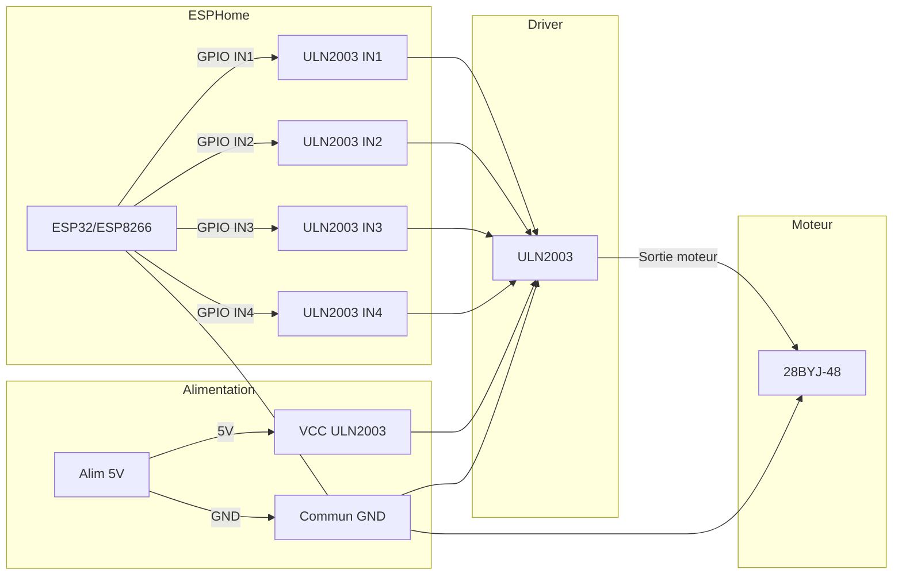

# Pompe Doseuses ESPHome

Ce projet propose une configuration ESPHome pour piloter **une pompe doseuse** munie d’un moteur pas à pas **28BYJ-48** (5V) et de son driver **ULN2003**. La configuration peut être dupliquée afin de gérer plusieurs pompes depuis Home Assistant via des switches template.

## Fonctionnalités

- **Contrôle d'une pompe doseuse (duplicable) :**
  La configuration prévoit un moteur 28BYJ-48 et son driver ULN2003. Dupliquez ce bloc pour gérer plusieurs pompes.
- **Pilotage via composant `stepper` :**
  Utilisation du driver ULN2003 avec un moteur 28BYJ-48 en **demi-pas (HALF_STEP)** pour plus de couple.
- **Activation via Home Assistant :**
  Utilisation de switches template pour déclencher manuellement les scripts de contrôle.
- **Configuration flexible :**
  Possibilité d’ajuster les pins, le nombre de pas et les délais selon vos besoins.
- **Réglage dynamique de la vitesse :**
  Choisissez entre **Lent**, **Moyen** ou **Rapide** grâce à un sélecteur intégré.

## Matériel Requis

- Carte ESP32 (ou ESP8266 compatible avec ESPHome)
- 1 moteur pas à pas **28BYJ-48** (5V) et son driver **ULN2003** (à répéter pour chaque pompe supplémentaire)
- Alimentation 5V adaptée aux moteurs
- Câblage et connecteurs

## Schéma de câblage (illustration)

L’illustration ci-dessous résume les connexions essentielles entre l’ESP, le driver ULN2003 et le moteur 28BYJ-48. Les numéros de GPIO exacts sont à adapter en fonction des `substitutions` définies dans vos fichiers YAML.



**Rappels importants :**
- Les broches IN1 à IN4 correspondent aux sorties GPIO déclarées dans votre configuration ESPHome.
- **GND de l’ESP et de l’alimentation 5V doivent être communs**.
- Le moteur 28BYJ-48 se branche directement sur le connecteur du module ULN2003.

## Installation

1. **Copiez le contenu du fichier `install.yaml` :**  
   Ouvrez le fichier `install.yaml` du projet et copiez son contenu dans votre configuration ESPHome.
2. **Ouvrir le projet dans ESPHome :**  
   Chargez le fichier copié dans ESPHome.
3. **Configurer le fichier :**  
   Adaptez les pins et autres paramètres selon votre câblage (voir section **Câblage**).
4. **Compiler et téléverser :**  
   Compilez la configuration et téléversez-la sur votre carte via ESPHome.
5. **Intégrer dans Home Assistant :**  
   Ajoutez l’appareil via l’API ESPHome pour contrôler les pompes à distance.

### Organisation des fichiers

La configuration est découpée en modules pour faciliter la maintenance et la duplication des pompes :

- `install.yaml` : point d'entrée minimal à coller dans ESPHome.
- `pompe_doseuses_config.yaml` : assemble les modules via `packages`.
- `common/device_base.yaml` : base ESP32 (Wi-Fi, web_server, capteurs système, LED, etc.).
- `common/pompe_doseuses.yaml` : métadonnées et infos de diagnostic (version, GitHub).
- `common/pompe1.yaml` : logique complète d'une pompe (modes, calibration, scripts, UI).

Vous pouvez dupliquer `common/pompe1.yaml` (ex. `pompe2.yaml`) et ajouter le package correspondant pour gérer plusieurs pompes.

## Configuration

Le fichier de configuration inclut :

- **Substitutions :**
  Définition des pins pour chaque bobine des moteurs.
- **Déclaration du `stepper` ULN2003 :**
  Pilotage direct du moteur pas à pas via le composant `stepper` d’ESPHome (mode HALF_STEP, vitesse/accélération réglables).
- **Scripts de contrôle :**
  La distribution est découpée en **chunks** pour éviter les blocages quand le nombre de pas est élevé.
  Chaque chunk attend la fin du mouvement avec `wait_until` et relance la tranche suivante, puis finalise la dose.
- **Switches Template :**
  Permettent de lancer les scripts via Home Assistant.

> **Attention :**
> Les scripts utilisent des `wait_until` et des délais courts pour sécuriser l'exécution. Ajustez les vitesses si le moteur manque de couple.

## Câblage

Par défaut, la configuration utilise les GPIO suivants pour le driver ULN2003 :

| Bobine ULN2003 | GPIO ESP32 |
|---------------|-----------|
| IN1 (A)       | GPIO13    |
| IN2 (B)       | GPIO14    |
| IN3 (C)       | GPIO26    |
| IN4 (D)       | GPIO27    |

Adaptez ces broches si votre câblage est différent.

## Alimentation propre (fortement recommandé)

L’installation désactive la détection de brownout (`-DBROWNOUT_DISABLE` dans `install.yaml`). En cas d’effondrement momentané de l’alimentation (plusieurs moteurs qui commutent en même temps), l’ESP32 peut alors devenir instable au lieu de redémarrer proprement. **Une alimentation propre est donc essentielle**.

À minima, mettez en place ces bonnes pratiques :

- **Alimentation 5 V dédiée pour les moteurs :** ne pas alimenter les ULN/moteurs depuis le 5 V de l’ESP/USB.
- **Masse commune obligatoire :** relier la masse de l’alim moteurs à celle de l’ESP (indispensable pour la référence des signaux).
- **Marge de courant confortable :** viser large (ex. **5 V / 3 A** pour 3–4 pompes).
- **Découplage :** ajouter un condensateur électrolytique **470–1000 µF** sur le 5 V moteurs près des cartes ULN, + **100 nF** près de chaque driver si possible.
- **Démarrages décalés :** éviter les démarrages simultanés si l’alim est petite en décalant les offsets/horaires de dose entre pompes.

## Modes de Fonctionnement et Paramétrage

Ce projet permet de contrôler et configurer les pompes doseuses via plusieurs modes de distribution. Voici un aperçu détaillé des différentes options disponibles, avec des explications approfondies et des conseils d'utilisation.

### **Choisir la Quantité à Distribuer Chaque Jour**
La quantité quotidienne de liquide distribuée par chaque pompe est configurable directement depuis Home Assistant ou l’interface Web ESPHome.

#### **Méthodes de Configuration :**
1. **Depuis Home Assistant :**
   - Accédez aux paramètres de la pompe.
   - Trouvez l’entrée **"Pompe X - Volume quotidien (ml)"**.
   - Ajustez la valeur selon vos besoins.

2. **Depuis l'interface Web ESPHome :**
   - Ouvrez la page Web du module ESPHome.
   - Repérez le paramètre **"Pompe X - Volume quotidien (ml)"**.
   - Modifiez la valeur et enregistrez les changements.

3. **Via l’API ESPHome et Home Assistant :**
   Vous pouvez automatiser ce paramètre via une requête API :
   ```yaml
   service: esphome.pompe_doseuse
   data:
     pump1_daily_quantity: 100.0
   ```
### **Sélection du Mode de Distribution**
La pompe doseuse permet de choisir parmi plusieurs modes de distribution grâce à un **sélecteur** intégré, disponible dans Home Assistant et l’interface web ESPHome.

#### **Méthodes de Sélection :**
1. **Depuis Home Assistant :**
   - Accédez aux paramètres de la pompe.
   - Trouvez l’entrée **"Pompe X - Mode de Distribution"**.
   - Sélectionnez le mode souhaité dans la liste déroulante.

2. **Depuis l’interface Web ESPHome :**
   - Ouvrez la page Web du module ESPHome.
   - Repérez le paramètre **"Pompe X - Mode de Distribution"**.
   - Choisissez l’option souhaitée.

3. **Via l’API ESPHome et Home Assistant :**
   Vous pouvez automatiser ce paramètre via une requête API :
   ```yaml
   service: esphome.pompe_doseuse
   data:
     pump1_distribution_mode: 2  # Mode 2 : 12 doses
   ```

#### **Valeurs Disponibles :**
| Mode | Fonctionnement |
|------|---------------|
| **Mode 0** | Dose manuelle (bouton uniquement) |
| **Mode 1** | 24 doses réparties sur la journée (une par heure) |
| **Mode 2** | 12 doses toutes les 2 heures |
| **Mode 3** | Répartition sur des périodes personnalisées |
| **Mode 4** | Minuteur permettant des doses à des horaires précis |

#### **Exemple de Configuration ESPHome :**
```yaml
select:
  - platform: template
    name: "Pompe 1 - Mode de Distribution"
    id: pump1_distribution_select
    icon: mdi:format-list-bulleted
    options:
      - "Mode 0: Dose manuelle"
      - "Mode 1: 24 doses"
      - "Mode 2: 12 doses"
      - "Mode 3: Périodes"
      - "Mode 4: Minuteur"
    lambda: |-
      int mode = id(pump1_distribution_mode);
      if (mode == 0) return std::string("Mode 0: Dose manuelle");
      else if (mode == 1) return std::string("Mode 1: 24 doses");
      else if (mode == 2) return std::string("Mode 2: 12 doses");
      else if (mode == 3) return std::string("Mode 3: Périodes");
      else if (mode == 4) return std::string("Mode 4: Minuteur");
      return {};
    set_action:
      - lambda: |-
          if (x == "Mode 0: Dose manuelle") id(pump1_distribution_mode) = 0;
          else if (x == "Mode 1: 24 doses") id(pump1_distribution_mode) = 1;
          else if (x == "Mode 2: 12 doses") id(pump1_distribution_mode) = 2;
          else if (x == "Mode 3: Périodes") id(pump1_distribution_mode) = 3;
          else if (x == "Mode 4: Minuteur") id(pump1_distribution_mode) = 4;
          ESP_LOGD("pump", "Nouveau mode = %d", id(pump1_distribution_mode));
```

Ce sélecteur permet de basculer facilement entre les différents modes et garantit que la pompe fonctionne selon les besoins définis.

#### **Répartition selon le Mode de Distribution :**
| Mode | Répartition des doses |
|------|-----------------------|
| **Mode 0** (Dose manuelle) | Dose déclenchée uniquement via le bouton |
| **Mode 1** (24 doses) | 100 ml / 24 → 4,16 ml par heure |
| **Mode 2** (12 doses) | 100 ml / 12 → 8,33 ml toutes les 2h |
| **Mode 3** (Périodes personnalisées) | Quantité répartie sur les plages horaires définies |
| **Mode 4** (Minuteur) | Volume attribué à chaque dose individuellement |

---

#### 1. **Mode 0 : Dose manuelle** (Bouton uniquement)
   - **Principe** : La dose est déclenchée uniquement via le bouton `Doser manuellement Pompe X`.
   - **Aucune planification** : aucune distribution automatique n’est faite en mode 0.
   - **Utilisation recommandée** : Pour une distribution ponctuelle contrôlée par l’utilisateur.
   - **Paramètre à configurer** :
     - `Pompe X - Volume quotidien (ml)`: quantité à distribuer à chaque appui.
   - **Exemple d'utilisation** : Vous souhaitez ajouter une dose de 10 ml de solution nutritive immédiatement.
   - **Exemple de configuration** :
     - `Pompe X - Volume quotidien (ml) = 10`
     - **Résultat** : La pompe distribuera **10 ml** à l’appui du bouton.

#### 2. **Mode 1 : 24 Doses (1 dose par heure)**
   - **Principe** : Répartition homogène de 24 doses sur 24 heures.
   - **Minute configurable** : L’utilisateur peut définir la **minute exacte** de chaque heure où le produit sera ajouté.
   - **Utilisation recommandée** : Pour des apports réguliers tout au long de la journée, tout en évitant que plusieurs pompes injectent en même temps des produits pouvant précipiter.
   - **Paramètres à configurer** :
     - `Pompe X - Volume quotidien (ml)`: le volume total est divisé en 24 parts égales.
     - `Pompe X - Offset minute`: Définit la minute exacte d’ajout du produit (ex: Xh10).
   - **Exemple d'utilisation** : Vous souhaitez ajouter 120 ml d'éléments traces chaque jour. Chaque heure, 5 ml seront distribués.

#### **Espacement des ajouts pour éviter les précipitations**
Ce mode permet de **décaler l’ajout de produits** entre plusieurs pompes afin d’éviter les réactions chimiques indésirables.
| Pompe    | Produit ajouté  | Offset minute |
|----------|-----------------|---------------|
| Pompe 1  | Calcium         | 5             |
| Pompe 2  | KH              | 15            |
| Pompe 3  | Magnésium       | 25            |
| Pompe 4  | Acides aminés   | 35            |

Ainsi, chaque produit est ajouté à un moment différent, réduisant les risques de précipitation.

#### **Configuration du paramètre "Offset minute" :**
1. **Depuis Home Assistant :**
   - Accédez aux paramètres de la pompe.
   - Trouvez l’entrée **"Pompe X - Offset minute"**.
   - Définissez la minute souhaitée (ex: 5 pour Xh05, 10 pour Xh10, etc.).

2. **Depuis l’interface Web ESPHome :**
   - Ouvrez la page Web du module ESPHome.
   - Modifiez le paramètre **"Pompe X - Offset minute"**.

3. **Exemple en YAML pour ESPHome :**
   ```yaml
   number:
     - platform: template
       name: "Pompe 1 - Offset minute"
       id: pump1_dose_offset_minute_num
       icon: mdi:timer
       min_value: 0
       max_value: 59
       step: 1
       lambda: |-
         return id(pump1_dose_offset_minute);
       set_action:
         - lambda: |-
             id(pump1_dose_offset_minute) = (int)x;
             ESP_LOGD("pump", "Nouvel offset minute: %d", id(pump1_dose_offset_minute));
   ```

#### 3. **Mode 2 : 12 Doses (1 dose toutes les 2 heures)**
   - **Principe** : 12 distributions sur la journée, espacées de 2 heures.
   - **Utilisation recommandée** : Pour éviter une fréquence trop élevée tout en maintenant une répartition homogène.
   - **Paramètres à configurer** :
     - `Pompe X - Volume quotidien (ml)`: divisé en 12 parts égales.
   - **Exemple d'utilisation** : Un apport de 60 ml par jour distribué en doses de 5 ml toutes les deux heures.

#### 4. **Mode 3 : Périodes personnalisées**
   - **Principe** : Répartition de la dose quotidienne sur plusieurs périodes définies par l’utilisateur (jusqu’à 6 par jour).
   - **Utilisation recommandée** : Pour planifier les ajouts de liquide à des moments précis de la journée, en fonction des besoins du bac ou aux besoins biologiques (ex : apports nutritifs en phase d'éclairage).
   - **Paramètres à configurer pour chaque période** :
     - `Période X - Start Hour` : heure de début de la période.
     - `Période X - Start Minute` : minute de début de la période.
     - `Période X - End Hour` : heure de fin de la période.
     - `Période X - End Minute` : minute de fin de la période.
     - `Période X - Doses` : nombre total de doses sur la période.

#### Activation/Désactivation et Nombre de Périodes Actives

Pour plus de flexibilité, il est possible d'activer ou de désactiver individuellement chaque période et de choisir le nombre de périodes utilisées dans la journée.

- **Activation/Désactivation des périodes :**
  Chaque période dispose d'un booléen qui permet de l'activer ou de la désactiver. Par défaut, les périodes 1 à 3 sont activées, tandis que les périodes 4 à 6 sont désactivées.
  
- **Sélecteur du nombre de périodes actives :**
  Un sélecteur permet de choisir dynamiquement le nombre de périodes utilisées (de 1 à 6). Par exemple, si vous choisissez 3, seules les périodes 1 à 3 seront prises en compte par le système.

La logique de distribution dans le Mode 3 utilise ces paramètres pour ne déclencher que les périodes activées et pour parcourir uniquement le nombre de périodes définies.

#### **Fonctionnement détaillé :**
1. L’utilisateur définit jusqu’à **6 périodes** réparties dans la journée.
2. Chaque période est caractérisée par une **heure de début et une heure de fin**.
3. L’utilisateur définit **le nombre de doses** à injecter pendant chaque période.
4. La dose quotidienne totale est **répartie entre ces doses**.

#### **Exemple de configuration :**
| Période  | Horaire           | Nombre de doses |
|----------|------------------|----------------|
| **Matin**  | 08h00 - 10h00   | 3 doses        |
| **Midi**   | 12h00 - 14h00   | 2 doses        |
| **Soir**   | 18h00 - 20h00   | 4 doses        |
| **Total**  | -               | 9 doses        |

Si la dose quotidienne est de **100 ml**, chaque dose sera calculée comme suit :
\[
\frac{100 \text{ ml}}{9} = 11.1 \text{ ml par dose}
\]

#### **Avantages du Mode 3 :**
✅ **Répartition optimisée** : Adaptable selon les besoins du bac.  
✅ **Évite les interactions chimiques** : Permet de mieux espacer les ajouts entre différentes pompes.  
✅ **Grande flexibilité** : L’utilisateur peut adapter les périodes aux habitudes biologiques du bac.  

#### 5. **Mode 4 : Minuteur**
   - **Principe** : Distribution à des heures spécifiques.
   - **Utilisation recommandée** : Pour des besoins précis nécessitant un dosage à des moments fixes.
   - **Paramètres à configurer** :
     - `Minuteur Dose X - Hour` : heure exacte de la dose.
     - `Minuteur Dose X - Minute` : minute exacte de la dose.
     - `Minuteur Dose X - Quantity (ml)` : volume à distribuer.
   - **Exemple d'utilisation** : 
     - Ajout de 10 ml à 9h30.
     - Ajout de 5 ml à 14h15 et 18h45.

> En Mode 4, le volume quotidien est recalculé dynamiquement à partir des doses configurées.
> Ce volume s’affiche dans le champ "Volume quotidien Pompe X (ml)" pour information, mais ne peut pas être modifié manuellement dans ce mode.

#### **Nom du produit distribué**
Chaque pompe peut avoir un nom de produit associé (ex : Calcium, KH, Aminés, etc.). Ce nom est affiché dans l’interface Web ESPHome ainsi que dans Home Assistant.

- **Affichage :** visible dans le champ "Pompe X - Produit distribué".
- **Modification :** via le champ texte "Pompe X - Nom du produit" disponible dans l’interface.
- **Stockage :** le nom est conservé après redémarrage.

Cette option permet de mieux identifier les pompes et leurs fonctions spécifiques.

---

### Paramétrage et Configuration

1. **Sélection du Mode**
   - Accédez à `Pompe X - Mode de Distribution` dans Home Assistant.
   - Sélectionnez le mode souhaité dans la liste déroulante.

2. **Configuration des Paramètres**
   - Ajustez les paramètres associés au mode sélectionné dans Home Assistant.
   - Pour les modes à doses multiples (Mode 1 et 2), le volume total est réparti automatiquement.
   - Pour les modes Périodes et Minuteur, définissez manuellement les heures et quantités.

3. **Validation et Suivi**
   - Consultez les logs ESPHome (`Logs en direct`) pour vérifier l'exécution des doses.
   - Appuyez sur le bouton `Valider Calibration Pompe X` après une calibration pour mettre à jour les paramètres internes.
   - Vérifiez régulièrement la précision des doses et ajustez la calibration si nécessaire.

### Calibration et enregistrement du facteur

Lors de la calibration, la pompe effectue par défaut **120 000 pas** configurés, et le script utilise **2× ce nombre** (soit **240 000 pas** en HALF_STEP), soit environ deux minutes de fonctionnement. Vous pouvez augmenter ce nombre (par exemple à 180 000 pas, soit 360 000 pas effectifs) via le paramètre **"Pompe 1 - Nombre de pas pendant la calibration"** afin d'obtenir un volume plus important.

Mesurez ensuite le volume réellement délivré (ex. dans une seringue graduée) et saisissez cette valeur dans le champ **"Pompe X - Volume mesuré (ml)"**.

Appuyez enfin sur **"Valider Calibration Pompe X"** pour enregistrer le nouveau facteur (ml/pas), calculé automatiquement.

Ce facteur sera utilisé dans tous les modes pour déterminer la quantité à distribuer.

> ℹ️ Les volumes utilisés lors de l'amorçage et de la calibration sont déduits du réservoir et comptés comme "volume utilisé", mais **ne sont pas ajoutés** au "volume distribué".

> ⚠️ Le lancement de la calibration est bloqué si le switch "Amorcer" est actif.
> Ces actions sont exclusives afin d’éviter les conflits moteurs.

### Conseils d'Utilisation
- Pour garantir la fiabilité du système, testez chaque mode avant de l'appliquer en condition réelle.
- Utilisez un débitmètre pour vérifier que les volumes distribués correspondent aux réglages.
- Assurez-vous que les tubes et pompes sont bien amorcés avant toute utilisation prolongée.

Ces instructions complètes vous permettent de tirer pleinement parti de votre système de pompes doseuses. N'hésitez pas à expérimenter et affiner les réglages pour optimiser la distribution selon vos besoins !

--- 

### **Activation/Désactivation de la pompe**
Chaque pompe peut être activée ou désactivée individuellement via un switch, accessible depuis l’interface web ESPHome et Home Assistant.

- **Paramètre associé** : `Pompe X - Activation`
- **Principe** : Lorsque la pompe est désactivée (la variable globale `pump1_enabled` est false), aucune distribution ne sera effectuée, même si les horaires sont respectés.
- **Utilisation** :
  - **Activation** : Cliquez sur le switch pour mettre `pump1_enabled` à true et permettre la distribution automatique selon le mode configuré.
  - **Désactivation** : Cliquez sur le switch pour mettre `pump1_enabled` à false et suspendre les dosages.
- **Interface** : Le switch "Activation Pompe 1" est visible dans l’interface web ESPHome ainsi que dans Home Assistant. L’état du switch est sauvegardé après redémarrage.

**Exemple de configuration du switch dans ESPHome :**
```yaml
switch:
  - platform: template
    name: "Activation Pompe 1"
    id: pump1_enable_switch
    restore_state: true
    optimistic: true
    lambda: |-
      return id(pump1_enabled);
    turn_on_action:
      - lambda: |-
          id(pump1_enabled) = true;
          ESP_LOGD("pump", "Pompe activée !");
    turn_off_action:
      - lambda: |-
          id(pump1_enabled) = false;
          ESP_LOGD("pump", "Pompe désactivée !");
```

This switch allows you to control the pump directly from the ESPHome web interface and Home Assistant.

### Amorçage (Priming)
Un switch dédié permet de lancer rapidement l'amorçage de la pompe pour remplir les tuyaux :

- **Paramètre associé** : `Amorcer Pompe 1 (Priming)`
- **Principe** : active temporairement le moteur pendant quelques secondes. Par défaut, l'amorçage vise **2 ml** en se basant sur le facteur de calibration ; si le facteur est inconnu, un **mode par défaut (≈ 2500 pas)** est utilisé.
- **Utilisation** : à déclencher après installation ou maintenance pour éviter les bulles d'air.
- **Note** : le volume déplacé par l'amorçage est déduit du réservoir (volume utilisé) mais n'est pas comptabilisé comme volume distribué dans le bac.

### Dose manuelle
Un bouton permet d'injecter manuellement la quantité configurée :

- **Bouton** : `Doser manuellement Pompe 1`
- **Fonctionnement** : envoie immédiatement une dose égale au volume quotidien paramétré.
- **Précaution** : la pompe doit être activée et aucune autre dose manuelle ne doit être en cours.

### Arrêt manuel
Un bouton permet d'interrompre une distribution en cours :

- **Bouton** : `Stopper distribution Pompe 1`
- **Fonctionnement** : arrête immédiatement la séquence active et remet la pompe à l'état "Prêt".

### Remplissage et remise à zéro des compteurs
- **Remplir réservoir** : le bouton `Remplir réservoir Pompe 1` remet le volume restant à la capacité configurée.
- **Réinitialiser Historique** : le bouton `Réinitialiser Historique Pompe 1` remet à zéro les compteurs **Volume utilisé (aujourd’hui)** et **Volume distribué (aujourd’hui)**, ainsi que le texte **Dernière dose**.

### Réglage de la vitesse
Un sélecteur "Pompe 1 - Vitesse" est maintenant disponible dans ESPHome et Home Assistant.
Il permet de choisir entre **Lent**, **Moyen** ou **Rapide** pour adapter la vitesse du moteur pas à pas selon vos besoins.

### Mode Test / Simulation
Pour valider votre configuration sans consommer de produit, activez le switch `Mode Test / Simulation`.
Lorsque ce mode est actif, la vitesse d'exécution est accélérée et la distribution est simulée sans actionner réellement la pompe.

---
## Diagnostics et suivi

Le firmware expose plusieurs entités de diagnostic utiles pour le suivi et le dépannage :

- **Infos système** : température interne, uptime, signal Wi-Fi (dB et %).
- **Infos réseau** : IP, MAC, SSID, BSSID via `wifi_info`.
- **Debug** : heap libre, taille max de bloc, loop time, device info, reset reason.

Ces entités sont regroupées dans l'interface web ESPHome (groupes "Diagnostic" et "Debug").

### Suivi du réservoir et des doses

La pompe maintient des informations de suivi (volume restant, volume distribué/consommé, dernier dosage). Elles permettent d'afficher dans Home Assistant :

- **Volume restant** (basé sur la capacité du réservoir et la consommation).
- **Volume distribué aujourd'hui**.
- **Volume utilisé aujourd'hui** (inclut amorçage, calibration, tests).
- **Dernière dose** (horodatage texte).
- **Rappel** : l'amorçage et la calibration déduisent du réservoir sans augmenter le volume distribué.

Pensez à mettre à jour la **capacité du réservoir** pour un calcul cohérent.

---
## Détection de blocage moteur (limites)

### a) Pourquoi le système ne peut pas savoir si le moteur décroche
Le pilotage du **moteur pas à pas** via le driver **ULN2003** est en **open-loop** : le firmware envoie des impulsions, mais ne mesure **aucun retour**. Il n’y a :

- **pas de capteur de position**,
- **pas d’encodeur**,
- **pas de retour d’effort**.

Donc si le moteur décroche (tube pincé, galet bloqué, viscosité, etc.), le firmware “croit” quand même avoir avancé, car il a bien envoyé les impulsions. C’est une limite structurelle de ce type de montage.

### b) Mesure de courant : utile, mais souvent insuffisante avec ULN2003 + 28BYJ
Il est possible d’ajouter une **mesure de courant** sur le **5 V moteurs** (INA219/INA226, ou shunt + ADC). Cela peut aider à détecter :

- **moteur débranché** (courant ≈ 0),
- **court-circuit / problème driver** (courant anormal),
- **blocage franc** si cela provoque une variation de courant suffisante.

Cependant, avec ce type de moteur/driver, le courant est surtout **résistif** (bobines). Un blocage mécanique ne fait pas forcément varier le courant de manière significative, donc ce n’est **pas une détection fiable à 100 %**.

#### Proposition de code (détection d’anomalies de courant)
Le projet inclut un package optionnel `common/current_monitoring.yaml` qui ajoute un capteur INA219 et un **binaire de diagnostic** pour signaler un courant **trop faible** (moteur débranché) ou **trop élevé** (court-circuit / blocage franc).

Activez-le en ajoutant le package dans votre configuration :

```yaml
packages:
  device_base: !include common/device_base.yaml
  pompe_doseuses: !include common/pompe_doseuses.yaml
  debug: !include common/debug.yaml
  pompe1: !include common/pompe1.yaml
  current_monitoring: !include common/current_monitoring.yaml
```

Vous pouvez ajuster les seuils et les pins I2C via les substitutions :

```yaml
substitutions:
  motor_current_i2c_sda: GPIO21
  motor_current_i2c_scl: GPIO22
  motor_current_ina219_address: "0x40"
  motor_current_shunt_ohms: "0.1"
  motor_current_min_ma: "20"
  motor_current_max_ma: "700"
```

---
## Home Assistant : carte Lovelace

Un exemple de carte est disponible dans `Config HA/Lovelace card`. Cette carte regroupe :

- La consommation et le volume restant.
- Les réglages principaux (volume quotidien, offset, mode, vitesse).
- Les paramètres de chaque période (Mode 3) et des minuteurs (Mode 4).

Copiez le contenu dans une carte manuelle pour obtenir une interface prête à l'emploi.

### Présentation de l’interface Lovelace

Cette interface met en avant les **fonctions dynamiques** pilotées par le code : affichage conditionnel, calculs automatiques et modes adaptatifs. L’objectif est d’expliquer comment la carte réagit aux valeurs et aux modes, sans dépendre d’illustrations.

#### Informations de synthèse (mise à jour en temps réel)


- **Nom du produit** : modifiable à la volée, et reflété immédiatement dans la carte.
- **Dernière distribution** : horodatage + volume de la dernière dose déclenchée.
- **Progression journalière** : ratio *dose réalisée / dose planifiée* recalculé automatiquement.
- **Ajouts du jour** : total cumulé incluant les ajouts non programmés.
- **Volume restant** : recalculé à partir de la capacité et des volumes consommés.
- **État de la pompe** : statut, Wi-Fi et température interne remontés en continu.

#### Sélection du mode de distribution (logique et calculs associés)


- **Mode 0 – Dose manuelle** : le slider définit la quantité d’un ajout immédiat, sans planification.


- **Mode 1 – 24 doses** : la quantité journalière est automatiquement divisée en 24 doses (1 par heure).


- **Mode 2 – 12 doses** : la quantité journalière est automatiquement divisée en 12 doses (toutes les 2 heures).


- **Mode 3 – Périodes** : jusqu’à 6 périodes, **affichées dynamiquement** quand les champs sont renseignés. La dose journalière est répartie sur le total de doses définies dans les périodes actives.


  Les priodes suivantes s'affichent dynamiquement si les données sont configurées pour la période
- **Mode 4 – Minuteur** : jusqu’à 6 ajouts **indépendants**, avec des volumes définis par dose. Le total quotidien est recalculé à partir des quantités programmées.

  Les minuteurs suivants s'affichent dynamiquement si les données sont configurées pour le minuteur précédent

#### Réglages communs (toujours disponibles)


- **Activation / arrêt** : contrôle immédiat de l’état de la pompe.
- **Calibration** : enregistrement du facteur ml/pas et validation de la mesure.
- **Amorçage / réservoir** : actions de maintenance et remise à niveau des compteurs.
- **Vitesse / test / remise à zéro** : actions de service accessibles quel que soit le mode.

#### Autonomie opérationnelle


Les pompes restent **autonomes** : elles continuent à distribuer même si Home Assistant est indisponible. Chaque module peut exposer sa propre page de configuration via le serveur web intégré.

---
## Contributions

Les contributions et suggestions sont les bienvenues !
Pour proposer des améliorations, ouvrez une [issue](https://github.com/Twinsen68/Pompe_doseuses_esphome/issues) ou soumettez une pull request.

## License

Ce projet est distribué sous la licence [Non-Commercial](LICENSE).
This project is distributed under the [Non-Commercial](LICENSE) license.
